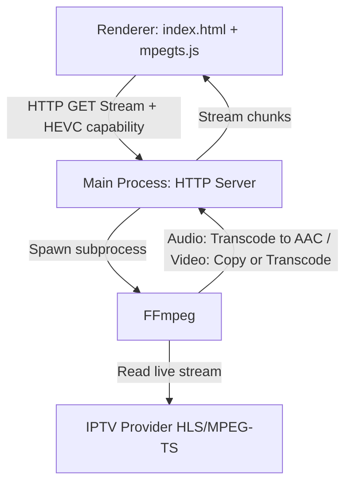

# 📡 IPTV Player Pro: Current App State & Architecture

This document describes the current architecture, implementation details, and codebase state of the Electron IPTV Player application.

---

## 🏗️ Architecture Overview

The application is built on **Electron** and solves the **AC3/E-AC3 audio codec limitations of Chromium** by using a **Main-Process Transcoding Proxy** powered by the system's native **FFmpeg** installation.



### Key Components

1. **Local Transcoding HTTP Server (Main Process):**
   - Runs on `http://127.0.0.1:18080`.
   - Endpoint: `/stream?url=<IPTV_STREAM_URL>&start=<SEEK_SECONDS>&hevc=<true|false>`.
   - Spawns a dedicated `ffmpeg` subprocess for each active stream.
   - Cleans up and kills previous FFmpeg subprocesses instantly on channel switches or client disconnections.
   - Writes CORS and Private Network Access (PNA) headers.

2. **FFmpeg Pipeline & Args (`buildFfmpegArgs`):**
   - Video transcoding: If video codec is unsupported (`hevc`, `h265`, `mpeg2video`, `vc1`, etc.), transcodes to H.264 (`-c:v libx264`). If client supports HEVC natively (`hevc=true` query param detected via browser support check) or video is already compatible, uses copy mode (`-c:v copy`) to save CPU.
   - Audio: Transcoded to AAC stereo (`-c:a aac -b:a 192k -ac 2`) to ensure Chromium compatibility.
   - Stream optimizations: Applies connection timeouts, reconnect parameters, and disables subtitles/data streams.

3. **MPEG-TS Client Demuxer & Player (Renderer Process):**
   - Utilizes `mpegts.js` to demux transcoded stream to fragmented MP4 (fMP4) on-the-fly and feeds it to HTML5 `<video>` via Media Source Extensions (MSE).
   - Toggles **Player-Only (TV) View** (removes sidebar/topbar) via dedicated button or Escape key.
   - Autohides controls after 3 seconds of user inactivity with a translucent blur overlay.
   - Switches back to normal mode automatically when switching to the external player (MPV) or stopping playback.

---

## 📂 File Directory Map

All active files are placed in the project root: `/home/oliverzein/Dokumente/Daten/Development/Electron/IPTV/`

### Documentation & Configs
- **[CLAUDE.md](file:///home/oliverzein/Dokumente/Daten/Development/Electron/IPTV/CLAUDE.md)**: Project-specific guidelines, build commands, and workflows.
- **[.fallowrc.json](file:///home/oliverzein/Dokumente/Daten/Development/Electron/IPTV/.fallowrc.json)**: Configuration for Fallow static analysis to eliminate false positive dead code warnings.
- **[docs/app_state.md](file:///home/oliverzein/Dokumente/Daten/Development/Electron/IPTV/docs/app_state.md)**: This document.
- **[docs/app_image.md](file:///home/oliverzein/Dokumente/Daten/Development/Electron/IPTV/docs/app_image.md)**: Linux AppImage build and usage instructions.

### Codebase
- **[package.json](file:///home/oliverzein/Dokumente/Daten/Development/Electron/IPTV/package.json)**: Manifest listing dependencies (Electron, mpegts.js) and build settings.
- **[main.js](file:///home/oliverzein/Dokumente/Daten/Development/Electron/IPTV/main.js)**: Main process. Configures BrowserWindow, spawns local proxy, dynamically constructs FFmpeg arguments via `buildFfmpegArgs`, and forwards renderer console logs.
- **[preload.js](file:///home/oliverzein/Dokumente/Daten/Development/Electron/IPTV/preload.js)**: Safe IPC bridge exposing proxy URL and MPV launch APIs to renderer.
- **[db.js](file:///home/oliverzein/Dokumente/Daten/Development/Electron/IPTV/db.js)**: IndexedDB helper caching Xtream Codes accounts, categories, and streams.
- **[index.html](file:///home/oliverzein/Dokumente/Daten/Development/Electron/IPTV/index.html)**: UI markup (sidebar layout, category filters, overlays, controls).
- **[stream_info.html](file:///home/oliverzein/Dokumente/Daten/Development/Electron/IPTV/stream_info.html)**: Metadata viewer window showing stream/codec specs.
- **[style.css](file:///home/oliverzein/Dokumente/Daten/Development/Electron/IPTV/style.css)**: Neon-cyberpunk stylesheet. Handles grid layout, transition optimizations, multi-line clamps, and TV Mode CSS.
- **[renderer.js](file:///home/oliverzein/Dokumente/Daten/Development/Electron/IPTV/renderer.js)**: Client-side logic. Parses playlists, updates filters, detects native HEVC support, and handles custom player controls (decomposed into playback, mode toggles, external player, seeking, and autohide).

### Scripts & Assets
- **[scripts/deploy.sh](file:///home/oliverzein/Dokumente/Daten/Development/Electron/IPTV/scripts/deploy.sh)**: Packaging and release script leveraging Electron Builder and GitHub CLI (`gh`).
- **[scripts/install.sh](file:///home/oliverzein/Dokumente/Daten/Development/Electron/IPTV/scripts/install.sh)**: Script to copy built AppImage, install icons, and register local desktop shortcuts.
- **[assets/placeholder.png](file:///home/oliverzein/Dokumente/Daten/Development/Electron/IPTV/assets/placeholder.png)**: Visual placeholder fallback for channel cards/logo.

---

## 🚀 Running & Building

```bash
# Start in dev mode
npm start

# Build AppImage locally
npm run dist

# Deploy/Publish release
./scripts/deploy.sh --release
```
