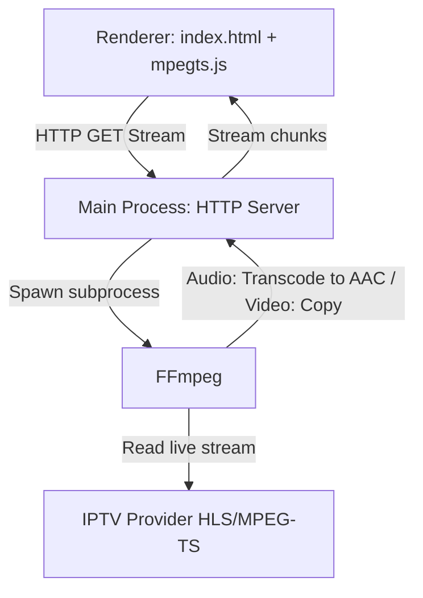

# 📡 IPTV Player Pro: Current App State & Architecture

This document describes the current architecture, implementation details, and codebase state of the Electron IPTV Player application.

---

## 🏗️ Architecture Overview

The application is built on **Electron** and solves the **AC3/E-AC3 audio codec limitations of Chromium** by using a **Main-Process Transcoding Proxy** powered by the system's native **FFmpeg** installation.



### Key Components

1. **Local Transcoding HTTP Server (Main Process):**
   - Runs on `http://127.0.0.1:18080`.
   - Listens to incoming requests at `/stream?url=<IPTV_STREAM_URL>`.
   - Spawns a dedicated `ffmpeg` subprocess for each active stream.
   - Restructures headers to include **Private Network Access (PNA)** and **CORS** rules.
   - Cleans up and kills previous FFmpeg subprocesses instantly on channel switches or client disconnections to conserve system resources.

2. **FFmpeg Pipeline:**
   - Command: `ffmpeg -loglevel warning -i <STREAM_URL> -c:v copy -c:a aac -b:a 192k -ac 2 -f mpegts pipe:1`.
   - **Video:** Passed through directly (`-c:v copy`) requiring near-zero CPU.
   - **Audio:** Transcoded from any source format (including AC-3, E-AC-3, MP3) to standard AAC stereo (`-c:a aac -b:a 192k -ac 2`) to ensure compatibility with Chromium.
   - **Output Format:** Wrapped in a standard MPEG-TS stream container (`-f mpegts`) and piped to the local HTTP response.

3. **MPEG-TS Client Demuxer (Renderer Process):**
   - Utilizes [mpegts.js](https://github.com/xqq/mpegts.js) in the renderer.
   - Receives the transcoded MPEG-TS stream over HTTP from the local proxy server.
   - Demuxes the MPEG-TS container into fragmented MP4 (fMP4) chunks in JavaScript on-the-fly.
   - Feeds the fMP4 chunks directly into the standard HTML5 `<video>` element via the browser's **Media Source Extensions (MSE)**.

---

## 📂 File Directory Map

All active files are placed in the project root: `/home/oliverzein/Dokumente/Daten/Development/Electron/IPTV/`

- **[docs/implementation_plan.md](file:///home/oliverzein/Dokumente/Daten/Development/Electron/IPTV/docs/implementation_plan.md)**: Original step-by-step implementation strategy.
- **[docs/app_state.md](file:///home/oliverzein/Dokumente/Daten/Development/Electron/IPTV/docs/app_state.md)**: This document (Active application overview).
- **[package.json](file:///home/oliverzein/Dokumente/Daten/Development/Electron/IPTV/package.json)**: Node.js project manifest. Lists `electron` (devDependencies) and `mpegts.js` (dependencies).
- **[main.js](file:///home/oliverzein/Dokumente/Daten/Development/Electron/IPTV/main.js)**: Main process. Configures Electron `BrowserWindow`, sets up the HTTP proxy, spawns and cleans up FFmpeg, and forwards renderer console logs to terminal output for debugging.
- **[preload.js](file:///home/oliverzein/Dokumente/Daten/Development/Electron/IPTV/preload.js)**: Safe IPC gateway. Exposes `window.electronAPI.getProxyUrl(url)` to the renderer context.
- **[index.html](file:///home/oliverzein/Dokumente/Daten/Development/Electron/IPTV/index.html)**: Front-end structure. Contains the sidebar layout, playlist loader (URL / file), search controls, category filters, and custom player overlays.
- **[style.css](file:///home/oliverzein/Dokumente/Daten/Development/Electron/IPTV/style.css)**: Neon-cyberpunk glassmorphic stylesheet.
  - Implements `scrollbar-gutter: stable` to avoid layout shift when scrollbars appear.
  - Fixes layout skewing by targeting transitions specifically (`background-color, border-color, transform, box-shadow`) instead of `all`.
  - Implements a `-webkit-line-clamp: 2` multi-line wrap for long channel names with `min-height: 60px` card frames.
- **[renderer.js](file:///home/oliverzein/Dokumente/Daten/Development/Electron/IPTV/renderer.js)**: Renderer process logic. Parses M3U playlist entries, updates filters and categories, manages card click handlers, and controls player playback/volume/fullscreen states.
- **[assets/placeholder.png](file:///home/oliverzein/Dokumente/Daten/Development/Electron/IPTV/assets/placeholder.png)**: Futuristic neon purple/cyan media poster image.

---

## 🚀 Running the Application

Ensure Node.js and system `ffmpeg` are installed. Run from the project root:

```bash
npm start
```

### Testing Playlist

A preset channel playlist is configured by default (Al Jazeera English, NHK World, ABC News, TRT World).
You can load custom playlists by drag-and-drop or entering local paths, e.g., the user-specific playlist:
`[celluloidTV.m3u](file:///home/oliverzein/Dokumente/Daten/Development/Electron/IPTV/Playlists/celluloidTV.m3u)`
