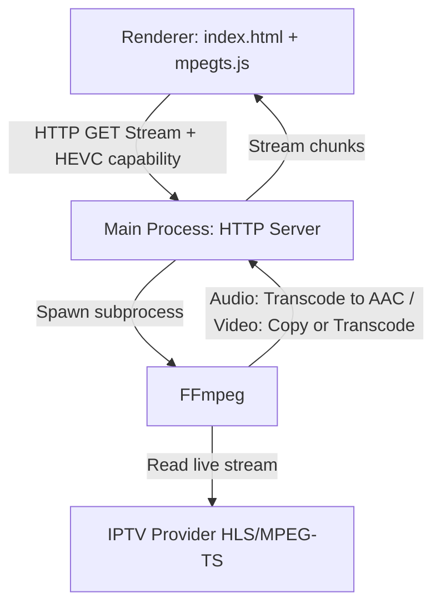

# 📡 IPTV Player Pro: Developer Onboarding & Architecture Guide

Welcome! This document provides a high-level guide to the codebase architecture, file structures, and how to get started as a developer.

---

## 🏗️ Core Architecture Overview

Chromium cannot natively play AC3/E-AC3 audio. This app solves this by running a **Main-Process Transcoding Proxy** that uses the system's native **FFmpeg** to transcode audio to standard AAC on-the-fly, copying compatible video streams with 0% CPU overhead.



### Stream Pipeline Flow
1. **User interaction**: Clicking a channel in the sidebar triggers playback.
2. **Codec check**: [renderer.js](file:///home/oliverzein/Dokumente/Daten/Development/Electron/IPTV/renderer.js) checks for native browser HEVC decoding support via `canPlayType`.
3. **Proxy endpoint**: Renderer requests the proxy stream URL via the [preload.js](file:///home/oliverzein/Dokumente/Daten/Development/Electron/IPTV/preload.js) IPC gateway, querying: `http://127.0.0.1:18080/stream?url=<STREAM_URL>&start=<SEEK_SECONDS>&hevc=<true|false>`.
4. **Main process proxy**: [main.js](file:///home/oliverzein/Dokumente/Daten/Development/Electron/IPTV/main.js) launches a node HTTP server, probes the stream using `ffprobe`, builds arguments with `buildFfmpegArgs()`, and spawns a native FFmpeg subprocess.
5. **Transcoding**: FFmpeg transcodes audio to AAC (`-c:a aac -b:a 192k -ac 2`) and either transcodes video to H.264 (`-c:v libx264`) or passes it through (`-c:v copy`) if HEVC is natively supported or compatible.
6. **Playback**: FFmpeg pipes stdout to the local HTTP response. `mpegts.js` in the renderer demuxes the MPEG-TS stream into fragmented MP4 (fMP4) chunks, feeding them to the HTML5 `<video>` element.

---

## 📂 File Directory Map

All active files are placed in the project root: `/home/oliverzein/Dokumente/Daten/Development/Electron/IPTV/`

### 📝 Documentation & Configs
- **[CLAUDE.md](file:///home/oliverzein/Dokumente/Daten/Development/Electron/IPTV/CLAUDE.md)**: Developer instructions, workflow commands, and code guidelines.
- **[.fallowrc.json](file:///home/oliverzein/Dokumente/Daten/Development/Electron/IPTV/.fallowrc.json)**: Entrypoints for Fallow static analysis to eliminate false positive dead code warnings.
- **[docs/app_state.md](file:///home/oliverzein/Dokumente/Daten/Development/Electron/IPTV/docs/app_state.md)**: This onboarding guide.
- **[docs/app_image.md](file:///home/oliverzein/Dokumente/Daten/Development/Electron/IPTV/docs/app_image.md)**: Packaging instructions for Linux AppImage.

### 💻 Codebase Entrypoints
- **[package.json](file:///home/oliverzein/Dokumente/Daten/Development/Electron/IPTV/package.json)**: Project dependencies (`electron`, `mpegts.js`) and build configurations.
- **[main.js](file:///home/oliverzein/Dokumente/Daten/Development/Electron/IPTV/main.js)**: Main process. Configures BrowserWindow, HTTP proxy server, FFmpeg process spawning, and log forwarding.
- **[preload.js](file:///home/oliverzein/Dokumente/Daten/Development/Electron/IPTV/preload.js)**: Context isolation IPC gateway between main and renderer.
- **[db.js](file:///home/oliverzein/Dokumente/Daten/Development/Electron/IPTV/db.js)**: IndexedDB caching layer for Xtream Codes credentials, categories, and stream metadata.
- **[index.html](file:///home/oliverzein/Dokumente/Daten/Development/Electron/IPTV/index.html)**: Main HTML structure (sidebar list, filter options, custom overlays).
- **[stream_info.html](file:///home/oliverzein/Dokumente/Daten/Development/Electron/IPTV/stream_info.html)**: Independent window showing ffprobe specification details.
- **[style.css](file:///home/oliverzein/Dokumente/Daten/Development/Electron/IPTV/style.css)**: Cyberpunk-glassmorphism stylesheet. Contains layout grids, animations, and TV mode UI states.
- **[renderer.js](file:///home/oliverzein/Dokumente/Daten/Development/Electron/IPTV/renderer.js)**: Renderer process. M3U parsing, DB operations, player setup (playback, seeking, autohide, external MPV player wrapper).

### 🛠️ Scripts & Assets
- **[scripts/deploy.sh](file:///home/oliverzein/Dokumente/Daten/Development/Electron/IPTV/scripts/deploy.sh)**: Automates package building (`npm run dist`) and GitHub Releases publishing.
- **[scripts/install.sh](file:///home/oliverzein/Dokumente/Daten/Development/Electron/IPTV/scripts/install.sh)**: Local AppImage path copier, icon extractor, and desktop launcher installer.
- **[assets/placeholder.png](file:///home/oliverzein/Dokumente/Daten/Development/Electron/IPTV/assets/placeholder.png)**: Neon fallback visual for channels without logos.

---

## 🚀 Getting Started

### 1. System Dependencies
Ensure you have the following installed on your machine:
- **Node.js** (v18+)
- **FFmpeg** and **FFprobe** (must be available in system `PATH`)
- **MPV** (optional, for external player option)

### 2. Launching in Development
```bash
# Install packages
npm install

# Start Electron application
npm start
```

### 3. Verification & Quality Tools
Before submitting code, check for dead code or architectural boundary issues:
```bash
# Run fallow static checks
npx fallow
```

### 4. Build & Release
```bash
# Generate local AppImage
npm run dist

# Trigger automated build and upload to GitHub Releases
./scripts/deploy.sh --release
```
