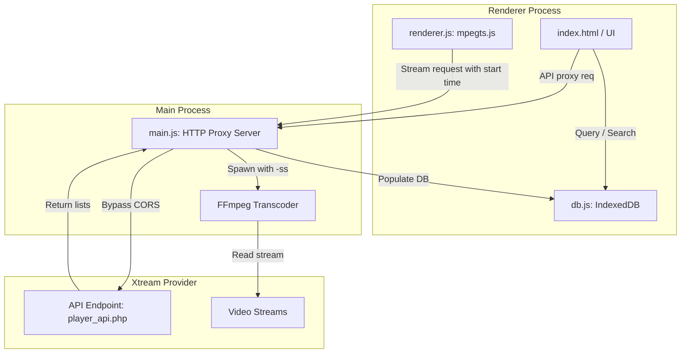

# 📡 Xtream Codes API Support Design Spec

This document details the architectural and UI specifications for adding Xtream Codes API support to the IPTV Player.

---

## 🏗️ Architectural Overview

Xtream Codes playlists can be extremely large, containing tens of thousands of channels, movies, and series. To handle this efficiently without blocking the UI thread or running into standard 5MB `localStorage` limits, this design introduces a client-side database cache using **IndexedDB**. 

To bypass CORS restrictions and retain compatibility with Chromium audio limits, all API requests and video streaming playback will be routed through the local Main-Process proxy server.



---

## 💾 Database Schema (IndexedDB)

We will use the native browser `IndexedDB` API (implemented via a helper module [db.js](file:///home/oliverzein/Dokumente/Daten/Development/Electron/IPTV/db.js)) to manage data.

### Database Name: `IPTVPlayerDB` (Version 1)

1. **`accounts`**:
   - Primary Key: `id` (string, generated uuid/timestamp)
   - Indexes: `name`
   - Fields: `id`, `name`, `host`, `username`, `password`

2. **`live_categories`**, **`vod_categories`**, **`series_categories`**:
   - Primary Key: `compoundKey` (computed as `accountId + '_' + categoryId`)
   - Indexes: `accountId`, `categoryId`
   - Fields: `accountId`, `categoryId`, `categoryName`

3. **`live_streams`**:
   - Primary Key: `compoundKey` (computed as `accountId + '_' + streamId`)
   - Indexes: `accountId`, `categoryId`, `name`
   - Fields: `accountId`, `streamId`, `categoryId`, `name`, `logo`, `streamType`

4. **`vod_streams`**:
   - Primary Key: `compoundKey` (computed as `accountId + '_' + streamId`)
   - Indexes: `accountId`, `categoryId`, `name`
   - Fields: `accountId`, `streamId`, `categoryId`, `name`, `logo`, `containerExtension`, `added`

5. **`series`**:
   - Primary Key: `compoundKey` (computed as `accountId + '_' + seriesId`)
   - Indexes: `accountId`, `categoryId`, `name`
   - Fields: `accountId`, `seriesId`, `categoryId`, `name`, `logo`, `releaseDate`

---

## 📡 Main Process HTTP Proxy Additions

We will add the following endpoints to the proxy server in [main.js](file:///home/oliverzein/Dokumente/Daten/Development/Electron/IPTV/main.js):

### 1. API proxy route `/xtream/api`
- Receives URL parameters: `host`, `username`, `password`, `action`, plus action-specific parameters like `series_id`.
- Forwards HTTP GET request to `http://<host>/player_api.php?username=<username>&password=<password>&action=<action>...`.
- Appends `Access-Control-Allow-Origin: *` to the response headers before piping the JSON response back to the renderer.

### 2. Stream proxy route `/stream` updates
- Accepts an optional `start` parameter (seconds) for seeking support: `/stream?url=<streamUrl>&start=<seconds>`.
- Spawns FFmpeg with seeking parameters if `start` is provided:
  ```bash
  ffmpeg -loglevel warning -ss <seconds> -i <STREAM_URL> -c:v copy -c:a aac -b:a 192k -ac 2 -f mpegts pipe:1
  ```
- If a client seeks or disconnects, the previous FFmpeg subprocess is killed.

---

## 🎨 User Interface & Interaction Flow

### 1. Menu Trigger
- Installs an Electron application menu item: `Playlists` -> `Manage Xtream Codes Accounts...`.
- Sends an IPC message to the renderer to trigger the Modal Dialog display.

### 2. Accounts Manager Modal Dialog
- Lists saved accounts with "Load" and "Delete" buttons.
- Form inputs: Profile Name, Server URL, Username, Password.
- Clicking "Add Account" saves the profile to IndexedDB.
- Clicking "Load" triggers connection, fetches categories and streams, updates the cache database, sets the active account, and closes the modal.

### 3. Sidebar Content Tabs
- Displays three tabs at the top of the sidebar when Xtream Codes is active: `Live`, `VOD`, `Series`.
- Switching tabs updates the sidebar list contents and categories filter list using IndexedDB indices.

### 4. VOD Seek Bar Integration
- Extends the custom player controls container with a timeline progress bar.
- Shows current elapsed time and duration for VOD streams.
- Clicking/dragging the seek timeline triggers a reload of the stream:
  1. Destroys the current player.
  2. Reloads the video source with `&start=X` (seconds).
  3. Re-attaches and resumes playback from target time.

### 5. Series Episode Selector
- Clicking a Series in the sidebar:
  1. Calls `/xtream/api?action=get_series_info&series_id=ID`.
  2. Renders a Season & Episode grid in the main right panel (hiding the video element).
  3. Clicking an Episode displays the video element and loads the episode stream: `http://<host>/series/<username>/<password>/<episode_id>.<extension>`.

---

## 🧪 Testing and Validation

1. **Database Operations:**
   - Verify accounts can be added, updated, and deleted in IndexedDB.
   - Verify category and stream items are successfully cached and queryable.

2. **CORS Bypass & API Calls:**
   - Verify the `/xtream/api` endpoint returns correct JSON data to the renderer.

3. **FFmpeg Transcoding & Seeking:**
   - Verify live streams play successfully.
   - Verify VOD files play and can seek using the progress bar.

4. **UI Responsiveness:**
   - Verify category selection and text searches do not block the UI thread when browsing databases with >10,000 items.
