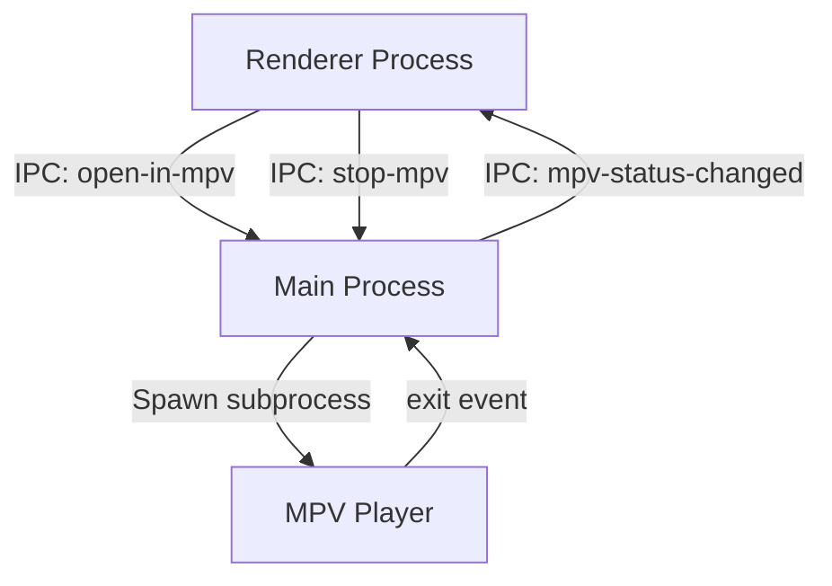

# 🎬 Design Spec: Comfortable MPV (External Player) Integration

## 📌 Goals & Success Criteria
* Provide a seamless workflow for playing IPTV streams (Live, VOD, Catch-up/Timeshift) in an external player (MPV).
* Implement an "Always use MPV" toggle directly in the main header for quick access.
* Fully hide/collapse the video player pane when MPV is active, allowing full-screen navigation of EPG and channel lists.
* Add a sleek glassmorphic status bar at the bottom showing current MPV status with actions to stop or switch to the internal player.
* Add direct MPV play buttons to channel list items and EPG archive cards.
* Sync playback state automatically when MPV is closed by the user.

---

## 🏗️ Architecture & Component Design



### 1. State Management
* **`isAlwaysMpvEnabled`**: Boolean, stored in `localStorage` under `alwaysUseMpv`. Defaults to `false`. When `true`, all channel/timeshift selection clicks bypass the internal player and open in MPV.
* **`isMpvActive`**: Boolean, tracks active MPV process state. Toggles CSS layouts and the status bar.

---

## 📂 Interface & Layout Changes

### 1. Header Control (`index.html` & `style.css`)
* Place a button `#btn-toggle-always-mpv` in the `.top-bar-right` next to the Cache Sync button.
* Display state:
  * **OFF**: Outlined border, dim text (`🎬 MPV Mode: OFF`).
  * **ON**: Cyan glow, filled background (`🎬 MPV Mode: ON`).

### 2. Floating Status Bar (`index.html` & `style.css`)
* Add a fixed status bar `#mpv-status-bar` at the bottom of the window:
  ```html
  <div id="mpv-status-bar" class="mpv-status-bar">
    <div class="mpv-status-content">
      <span class="pulse-dot green"></span>
      <span id="mpv-status-text">MPV playing: Stream Name</span>
    </div>
    <div class="mpv-status-actions">
      <button id="btn-mpv-stop" class="btn-sm btn-sm-danger">⏹ Stoppen</button>
      <button id="btn-mpv-internal" class="btn-sm btn-sm-primary">📺 Intern abspielen</button>
    </div>
  </div>
  ```

### 3. Layout Grid Adjustments (`style.css`)
* Active class `.mpv-active` added to `.app-container`.
* When `.mpv-active` is present:
  * Hide `#video-container` (`display: none !important`).
  * If EPG is closed (`:not(.epg-open)`): Set `grid-template-columns: 1fr` and hide `.main-content`. The channel sidebar takes 100% width.
  * If EPG is open (`.epg-open`): Show `.main-content` but set EPG sidebar to take 100% width, hiding the empty player area.

### 4. Direct Play Buttons (`renderer.js` & `style.css`)
* Inject an icon button `.mpv-direct-btn` (with symbol `🎬`) next to:
  * Channel names in the sidebar channel list.
  * Archive EPG badges.
* Only show these buttons when hovering over the parent item. Clicking them starts MPV immediately (bypassing the `isAlwaysMpvEnabled` check).

---

## 📡 IPC Communication Spec

### 1. Preload Gateway (`preload.js`)
* `openInMpv(streamUrl, streamName)`: Sends `{ url, name }` to main.
* `stopMpv()`: Sends `stop-mpv` signal to main.
* `onMpvStatusChanged(callback)`: Registers listener for `mpv-status-changed` events.

### 2. Main Process IPC handlers (`main.js`)
* Handle `open-in-mpv`:
  * Spawn `mpv [streamUrl]`.
  * Track process handle in `activeExternalProcess`.
  * Broadcast `mpv-status-changed` with `{ active: true, name: streamName }` to renderer.
  * Listen for subprocess `exit` event:
    * Clear `activeExternalProcess`.
    * Broadcast `mpv-status-changed` with `{ active: false }` to renderer.
* Handle `stop-mpv`:
  * Kill `activeExternalProcess` if exists (`SIGKILL`).

---

## 🧪 Error Handling & Edge Cases
* **MPV not installed**: If spawning `mpv` throws `ENOENT`, catch the error and send a notification to the renderer to display an error overlay.
* **Rapid switching**: If user starts a stream in MPV while another MPV stream is already playing, the existing process is killed synchronously before the new process is spawned.
* **Auto-pausing**: Spawning MPV pauses internal player playback if active, saving bandwidth.
