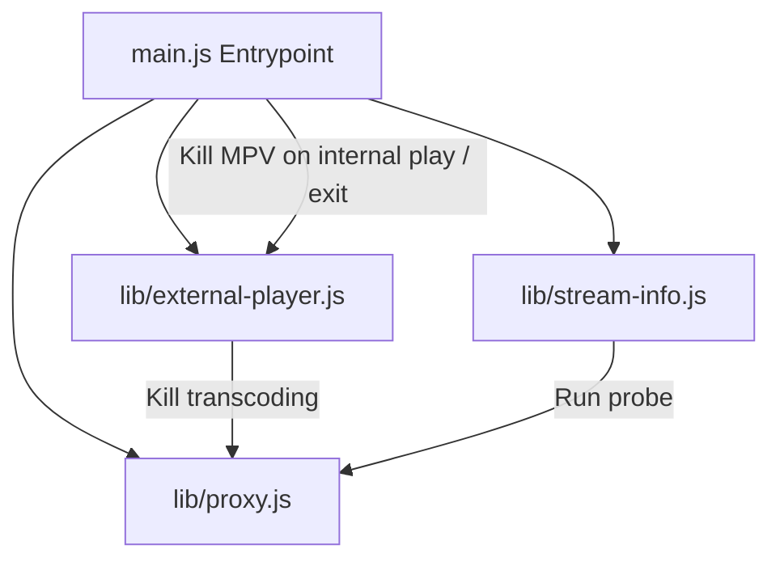

# Design Spec: main.js Modularization

**Date:** 2026-06-15  
**Topic:** Refactoring monolithic `main.js` into modular components to improve maintainability and testability.

---

## 🎯 Goals

1. **Keep `main.js` slim**: It should only handle basic Electron lifecycle management, main window creation, menu setups, and orchestrating modules.
2. **Dedicated Modules**: Group related tasks into cleanly encapsulated modules in a new `lib/` directory:
   - **`lib/proxy.js`**: HTTP streaming/API proxy server and FFmpeg/FFprobe transcoding core.
   - **`lib/external-player.js`**: External MPV player handling and context menu integration.
   - **`lib/stream-info.js`**: Independent stream information specs window management and query resolution.
3. **Decoupled Interfaces**: Use event-driven/registration pattern for communication and IPC registration. Eliminate global variables across modules.

---

## 🏗️ Architecture Split & Flow

The main application process will act as a orchestrator, initializing components on startup.

### 1. `lib/proxy.js`
Responsible for the streaming pipeline and forwarding Xtream Codes APIs.
- **State**:
  - `activeFfmpegProcess`
  - `metadataCache`
  - `proxyServer`
- **Exposed API**:
  - `init(getMainWindow, userDataPath)`: Starts the local HTTP proxy on port `18080` and starts handling routes.
  - `killActiveFfmpeg()`: Safely kills any active FFmpeg transcode processes.
  - `stop()`: Shuts down the HTTP server and stops any transcode tasks.
  - `runFfprobeCommand(ffprobeArgs, timeoutMs)`: Utility to spawn ffprobe, returned as a Promise. Used by `stream-info.js` to probe stream specs.

### 2. `lib/external-player.js`
Responsible for launching external MPV playback.
- **State**:
  - `activeExternalProcess`
- **Exposed API**:
  - `init(getMainWindow, killActiveFfmpeg)`: Configures external player IPC handlers (`open-in-mpv`, `stop-mpv`, `show-context-menu`).
  - `killActiveExternal()`: Safely kills the spawned MPV subprocess.

### 3. `lib/stream-info.js`
Responsible for managing the Stream Specifications window.
- **State**:
  - `streamInfoWindow`
- **Exposed API**:
  - `init(getMainWindow, runFfprobeCommand)`: Binds IPC handler `request-stream-info` and displays metadata specs window.
  - `closeWindow()`: Safely closes `streamInfoWindow`.

### 4. `main.js` (Orchestrator)
- **State**:
  - `mainWindow`
  - `activeStream`
- **Responsibilities**:
  - Append HEVC hardware decoding command line switches.
  - Lifecycle handlers: `ready`, `window-all-closed`, `activate`.
  - Window creation (`createWindow()`) & Console message mirroring from renderer.
  - Menu construction (`createMenu()`).
  - Playback status IPC handlers: `set-playback-active` (which triggers `externalPlayer.killActiveExternal()`) and `set-playback-inactive`.

---

## 🚦 Error Handling & Edge Cases

- **Process Terminations**: Ensure that when the main window closes or all windows are closed, all spawned subprocesses (FFmpeg & MPV) are forcefully terminated via `SIGKILL` to prevent orphan processes.
- **Cache Hit / Miss**: The metadata cache for ffprobe remains scoped inside `lib/proxy.js` to keep VOD loading times fast.
- **Proxy Re-entrancy**: Killing previous FFmpeg processes during new stream requests is handled encapsulated within `lib/proxy.js` before spawning new instances.
